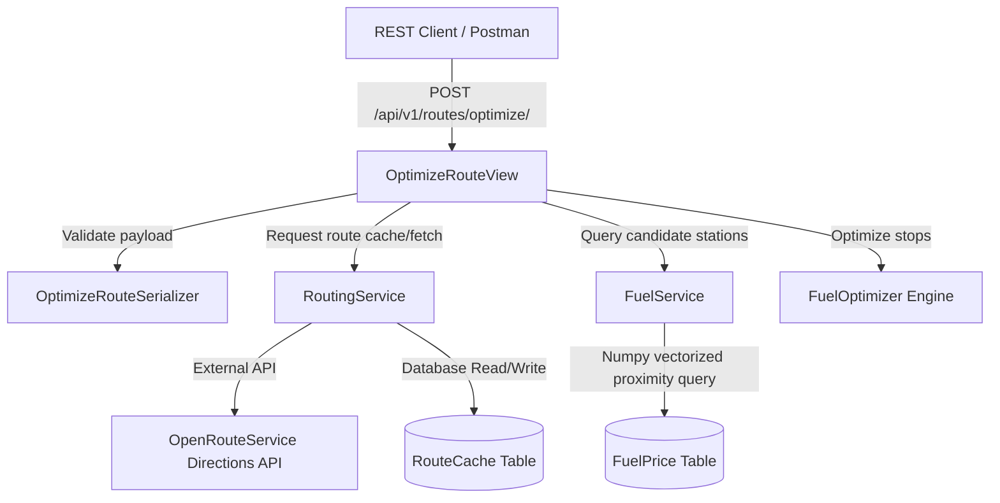

# Architectural Design Document

This system is built using **Clean Architecture** principles to separate concerns, ensure testability, and support high scalability.

## System Components

## Layer Separation

The project is structured under the `backend/` folder into isolated Django applications:

1. **`apps.routing`**: Handles geocoding and routing calculations. It coordinates with the OpenRouteService API and handles route cache querying/updating.
2. **`apps.fuel`**: Manages fuel station data. It handles the CSV import process, resolves station coordinates, and executes spatial calculations.
3. **`apps.optimization`**: Contains the core business rules of the application. It runs the greedy fuel stops optimization engine. It does not depend on Django models, views, or database tables, ensuring it can be tested in pure isolation.
4. **`config`**: Holds project configuration, environment loading, and Django settings.

---

## Fuel Stops Optimization Algorithm

The core optimization problem is defined as:
*Find a sequence of refuel stops along a route to travel from origin to destination at minimum fuel cost, given a vehicle range of 500 miles, fuel efficiency of 10 mpg (capacity = 50 gallons), and starting with a full tank of fuel.*

### Mathematical Definition
Let the stations along the route be represented by sorted distance coordinates:
$$S = \{s_1, s_2, \dots, s_n\}$$
with distance $x_i$ and fuel price $p_i$ ($/gallon). Let $s_0$ be the origin ($x_0 = 0$, $p_0 = \infty$, fuel level = 50) and $s_{n+1}$ be the destination ($x_{n+1} = D$, $p_{n+1} = 0$).

### Optimization Decision Logic (Greedy)
At any stop $s_i$ with current fuel $F$:
1. Look ahead at all reachable stops $s_j$ where $x_j - x_i \le 500$.
2. Find the first stop $s_k$ in this range that has a lower price: $p_k < p_i$.
   - **Case A**: A cheaper stop $s_k$ is found.
     We buy just enough fuel to reach $s_k$ with 0 fuel left.
     $$\text{Gallons to buy} = \max\left(0, \frac{x_k - x_i}{\text{mpg}} - F\right)$$
     Move to $s_k$ and update fuel level.
   - **Case B**: No cheaper stop is found in range (current stop is the cheapest local option).
     - If the destination $s_{n+1}$ is reachable ($D - x_i \le 500$):
       We only buy enough fuel to reach the destination.
       $$\text{Gallons to buy} = \max\left(0, \frac{D - x_i}{\text{mpg}} - F\right)$$
       We complete the journey.
     - If the destination is not reachable:
       We fill our tank to the maximum capacity of 50 gallons to maximize the fuel bought at this cheap price.
       $$\text{Gallons to buy} = 50 - F$$
       We then move to the cheapest reachable station in range to make the next refueling decision.

### Complexity Analysis
*   **Time Complexity**: $\mathcal{O}(N \log N)$ to sort candidates, and $\mathcal{O}(N)$ to traverse the sorted stops (where $N$ is the number of stations near the route).
*   **Space Complexity**: $\mathcal{O}(N)$ to hold the nearby stations and generated stops list.
